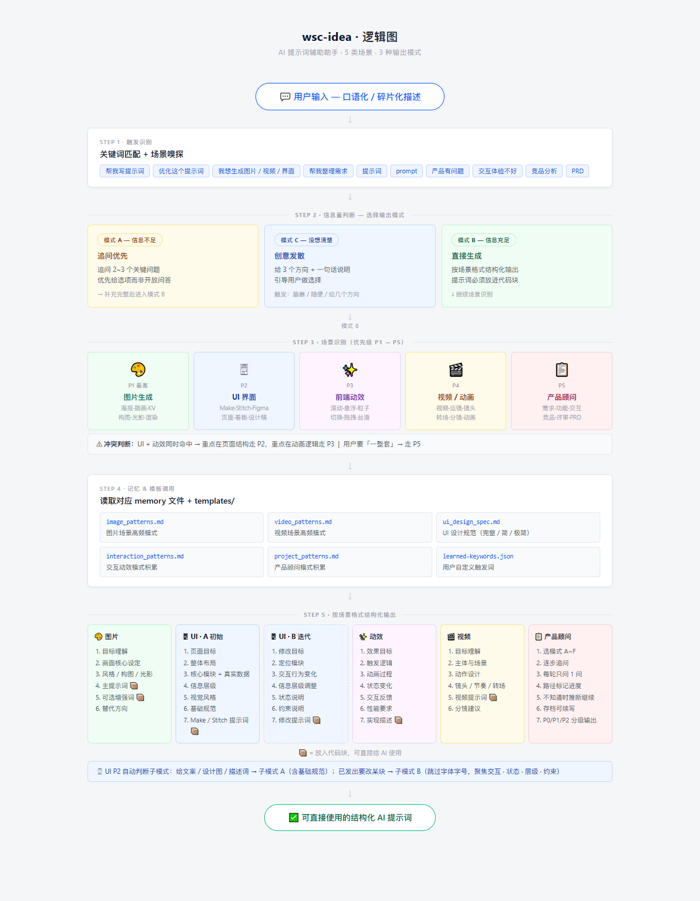

# wsc-idea · AI提示词助手 + B端产品设计顾问

> 一个 Claude Code Skill，把你的碎片想法转化为可直接使用的 AI 提示词，同时提供专业的 B 端产品设计咨询。

---

## 工作流程



---

## 能做什么

```
你说：「帮我生成一张赛博朋克风格的城市海报」
它输出：完整的 Midjourney / SD 提示词，含风格、构图、光影、材质

你说：「这个后台看板交互体验太差了」
它变成：产品顾问，逐步追问，最后给你分级改进方案（P0/P1/P2）
```

---

## 5 大场景

| # | 场景 | 触发词（举例） | 输出 |
|---|------|--------------|------|
| 🟢 S1 | **AI 生图提示词** | 图片、海报、KV、插画、光影、材质、渲染 | Midjourney / SD / Flux / DALL-E 提示词 |
| 🔵 S2 | **AI 生成 UI 界面** | UI、界面、页面、后台、看板、设计稿、Make、Stitch | Figma Make / Stitch 提示词 |
| 🟣 S3 | **前端动态交互效果** | 动效、粒子、滚动、悬浮、切换、拖拽、丝滑 | 前端实现描述 + 代码提示词 |
| 🟡 S4 | **AI 视频 / 动画提示词** | 视频、运镜、分镜、转场、动画、节奏 | 视频提示词 + 分镜建议 |
| 🔴 S5 | **产品设计顾问（B端）** | 产品有问题、交互体验、功能优化、需求分析、PRD、竞品分析 | 结构化分析报告 |

---

## 场景路由逻辑

```
用户输入
    │
    ▼
┌─────────────────────────────────────────┐
│              场景路由                    │
│  1. 命中「图片/海报/光影」  → S1 生图    │
│  2. 命中「UI/界面/页面」    → S2 UI界面  │
│  3. 命中「动效/粒子/滚动」  → S3 动效    │
│  4. 命中「视频/运镜/分镜」  → S4 视频    │
│  5. 命中「产品/需求/交互」  → S5 顾问    │
│                                         │
│  UI + 动效同时命中：                    │
│    页面结构优先 → S2                    │
│    动画逻辑优先 → S3                    │
│                                         │
│  信息不足 → 追问 2~3 个关键问题         │
└─────────────────────────────────────────┘
```

---

## S2 UI 界面场景：两种子模式

| 子模式 | 触发信号 | 输出 |
|--------|---------|------|
| **A · 初始生成** | 描述 / 截图 / 文案，还没生成过 | 完整布局 + 模块拆解 + 真实数据 + Make/Stitch 提示词 |
| **B · 迭代修改** | 已有结果，要改某块 / 觉得哪里不对 | 定位变化点 + 交互状态说明 + 修改提示词 |

---

## S5 产品顾问：6 种工作模式

```
你选择场景后，顾问先问你选哪个模式：

  A · 深度分析    系统性分析问题根因
  B · 交互优化    操作体验不好，快速改善
  C · 功能优化    已有功能改进完善
  D · 新功能设计  从零设计一个新功能
  E · 方案评审    已有方案，验证并找问题
  F · 竞品分析    对比行业做法和竞品
```

**工作方式：**
- 每轮只问你 **1 个问题**，等你回答再继续
- 路径标记进度：`[A › A1 › 3/5]`
- 你说"不知道" → 顾问合理推断继续，不卡住
- 最终输出按 **P0 / P1 / P2 分级**，每条具体可执行

---

## 通用规则

| 规则 | 说明 |
|------|------|
| 🌐 输出语言 | 始终中文，简洁直接，不说废话 |
| ❓ 信息不足 | 先追问 2~3 个关键问题，优先给选项 |
| 💡 脑暴模式 | 用户说「没想清楚」→ 给 3 个方向引导 |
| 📋 提示词格式 | 所有可给 AI 直接用的提示词放在代码块中 |

---

## 文件结构

```
wsc-idea/
├── SKILL.md                          # 技能主配置（场景识别 + 输出格式）
├── refine.json                       # 触发词与场景映射配置
│
├── memory/                           # 经验库（积累高频模式）
│   ├── scene-rules.json              # 场景判断规则
│   ├── image_patterns.md             # 图片场景经验库
│   ├── video_patterns.md             # 视频场景经验库
│   ├── interaction_patterns.md       # 动效场景经验库
│   ├── project_patterns.md           # 产品顾问经验库
│   ├── ui_design_spec.md             # UI 完整设计规范
│   ├── ui_design_spec_brief.md       # UI 设计规范简版
│   ├── ui_design_spec_ultra_brief.md # UI 设计规范极简版
│   └── learned-keywords.json         # 用户自定义触发词
│
└── templates/                        # 输出模板
    ├── image.md                      # 生图提示词模板
    ├── video.md                      # 视频提示词模板
    ├── interaction.md                # 动效描述模板
    ├── project.md                    # 产品顾问主控
    └── product-modes/                # 产品顾问 6 种模式
        ├── mode-a-analysis.md        # A · 深度分析
        ├── mode-b-interaction.md     # B · 交互优化
        ├── mode-c-feature.md         # C · 功能优化
        ├── mode-d-new-feature.md     # D · 新功能设计
        ├── mode-e-review.md          # E · 方案评审
        └── mode-f-competitor.md      # F · 竞品分析
```

---

## 快速上手

**生图场景：**
> 「帮我写一个魔幻森林风格的海报提示词，主角是一个穿盔甲的女骑士」

**UI 场景：**
> 「我要做一个数据看板，展示电商的销售额、订单量、退款率，帮我生成 Make 提示词」

**产品顾问：**
> 「我们的 B 端系统审批流程用户体验很差，有些步骤根本不知道下一步做什么」

---

*v2.0 · 基于 prompt-optimizer + product-design-advisor 融合*
